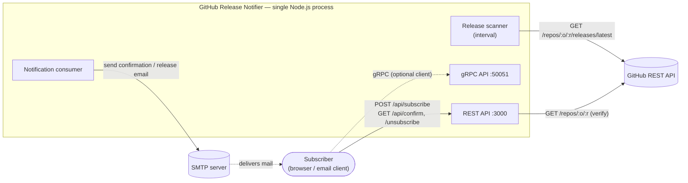
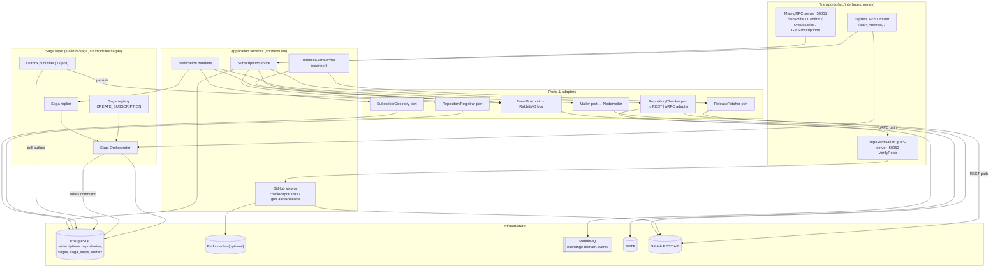
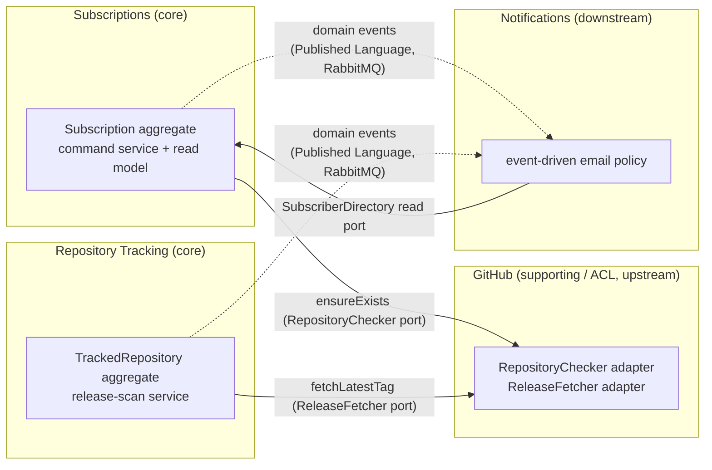
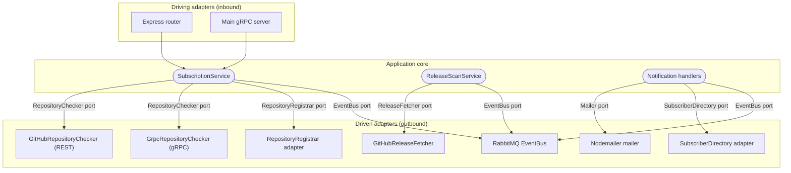
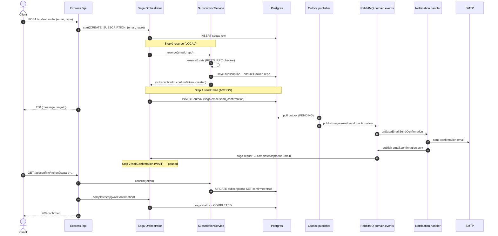
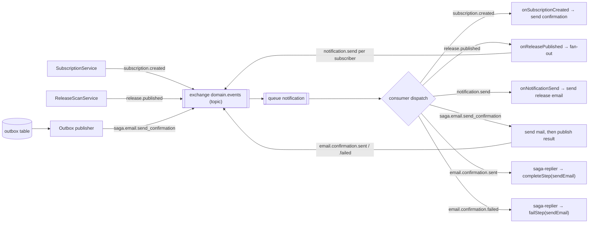
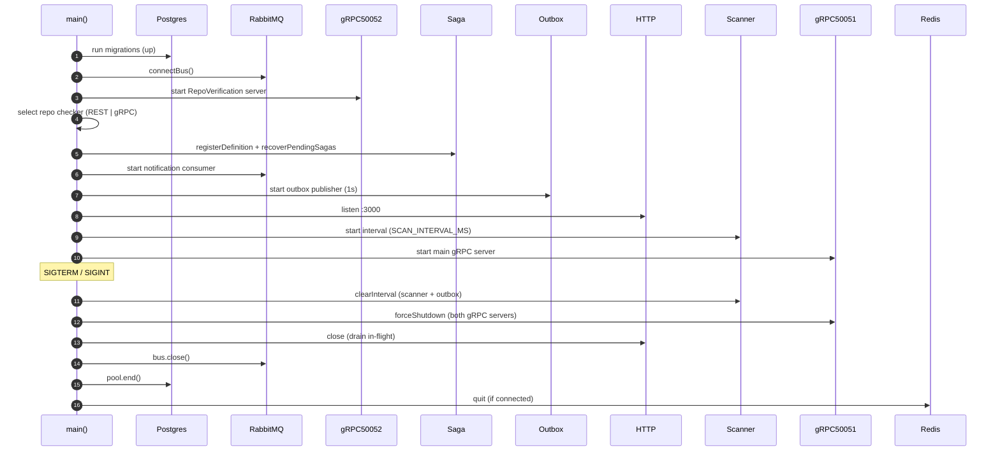

# Architecture — GitHub Release Notifier

This document is the visual, up-to-date architecture reference. It supersedes the ASCII
diagrams in [`sdd.md`](./sdd.md) and covers the orchestrated **Saga**, the **transactional
outbox**, and the **gRPC repo-verification transport**.

The service is a **modular monolith** in a single Node.js process: an Express REST API, a
main business gRPC server, a RepoVerification gRPC server, a background release scanner,
and a notification consumer. Modules are decoupled by **domain events** over a RabbitMQ
topic exchange and wired by **manual constructor injection** at one composition root
(`src/index.ts`).

---

## 1. System context

External actors around the process.

---

## 2. Container / component view

Transports drive application services, which depend only on **ports**; concrete adapters
bind those ports to infrastructure. The repo checker is swappable between an in-process
REST adapter and a gRPC adapter via the `REPO_CHECKER` env var.

---

## 3. Bounded contexts & anti-corruption layer

Four contexts. GitHub sits behind an **ACL**: each consumer owns the port it needs and
GitHub adapters translate the API payload into domain terms. Notifications is downstream,
integrating via a **Published Language** (domain events) plus a `SubscriberDirectory`
read port. Mirrors [`adr/0001-bounded-contexts-and-acl.md`](./adr/0001-bounded-contexts-and-acl.md).

---

## 4. Ports & adapters (hexagonal)

Application services depend on port interfaces; the compiler enforces the dependency
direction. Swapping a provider is a composition-root change plus a new adapter.

`REPO_CHECKER=grpc` injects `GrpcRepositoryChecker` (dials `localhost:50052`); the default
`rest` injects `GitHubRepositoryChecker` (in-process axios). The gRPC server itself wraps
the same REST `checkRepoExists`, so REST stays the single source of truth.

---

## 5. Create-subscription saga (end-to-end)

`CREATE_SUBSCRIPTION` has three steps: `reserve` (LOCAL) → `sendEmail` (ACTION, via
outbox) → `waitConfirmation` (WAIT, resumed by the confirmation HTTP request). Saga and
step state persist in Postgres, so a crash resumes from `recoverPendingSagas` on startup.

**Compensation.** Any step throw (or `email.confirmation.failed` → `failStep`) drives the
orchestrator into `COMPENSATING`: completed steps run their `compensate` in reverse. For
`reserve`/`waitConfirmation` this calls `service.cancel(subscriptionId)` **only** when the
saga actually created the row (`created === true`) — a pre-existing pending subscription is
left intact.

---

## 6. Messaging / event routing

One durable topic exchange `domain.events`; the notification module owns the single
`notification` queue and dispatches by routing key. Saga commands are published through the
**outbox** (write to DB in the same transaction as state, publish asynchronously) rather
than directly, so a command is never lost if the broker is briefly down.

Routing keys (`src/shared/events.ts`): `subscription.created`, `release.published`,
`notification.send`, `saga.email.send_confirmation`, `email.confirmation.sent`,
`email.confirmation.failed`. Delivery is at-least-once — the consumer acks on success,
nacks + requeues on handler failure.

---

## 7. Startup & shutdown

Startup is ordered so the broker connects before any publisher runs and the servers only
accept traffic after migrations and pending-saga recovery complete (`src/index.ts`).

---

## Source map

| Concern | Files |
|---|---|
| Composition root | `src/index.ts` |
| REST transport | `src/app.ts`, `src/modules/subscription/routes/index.ts` |
| gRPC transports | `src/interfaces/grpc.ts`, `src/interfaces/repo-verification.server.ts` |
| Subscription service | `src/modules/subscription/subscription.service.ts` |
| Saga | `src/infra/saga/orchestrator.ts`, `src/modules/sagas/create-subscription-saga.ts`, `src/modules/sagas/registry.ts`, `src/modules/sagas/saga-replier.ts` |
| Outbox | `src/infra/saga/outbox.repository.ts`, `src/infra/messaging/outbox-publisher.ts` |
| Messaging | `src/shared/events.ts`, `src/infra/messaging/rabbitmq-bus.ts`, `src/modules/notification/consumer.ts`, `src/modules/notification/handlers.ts` |
| Ports & adapters | `src/modules/*/ports/*`, `src/modules/github/*`, `src/modules/notification/nodemailer.mailer.ts` |
